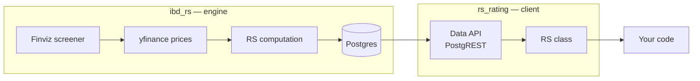
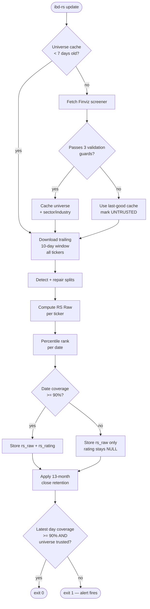

# Architecture

How the system is built, how data moves through it, and why the non-obvious parts are shaped the way they are. For contributors, self-hosters, and anyone deciding whether to trust the data.

## Two packages, one repository

The repository contains two Python packages that share a database and nothing else.



| | `ibd_rs` | `rs_rating` |
|---|---|---|
| Role | Produces ratings | Reads ratings |
| Runs | Once daily, in CI | In user code |
| Dependencies | pandas, yfinance, finvizfinance, requests, psycopg2 | **none** |
| Database access | Direct connection, read/write | HTTP, read-only |
| Installed by default from PyPI | No | Yes |

The split is deliberate and load-bearing. The client is the thing thousands of people might install, so it must never cause a dependency conflict — it uses `urllib` and `json` only. The engine is the thing one scheduled job runs, so it can freely depend on the scientific Python stack. Putting them in one distribution with optional extras means a `pip install ibd-rs-rating` pulls in nothing, while a self-hoster runs `pip install "ibd-rs-rating[engine,pg]"` and gets the whole pipeline.

## Module map

### `ibd_rs/` — the engine

| Module | Responsibility |
|---|---|
| `config.py` | Every tunable constant, each with a comment recording *why* that value. Read this first. |
| `cli.py` | Command definitions and orchestration. Each command is a sequence of numbered steps with progress output. |
| `tickers.py` | Universe acquisition from Finviz, with retry, three-axis validation, and cache management. |
| `nasdaq_trader.py` | Last-resort universe fallback from the Nasdaq Trader symbol directory. |
| `prices.py` | Batched price downloads via yfinance, with retry, backoff, and per-batch failure isolation. |
| `splits.py` | Detects suspicious price jumps and repairs split-affected tickers by re-downloading. |
| `rs.py` | The actual computation: RS Raw and RS Rating, plus incremental-vs-full recompute logic. |
| `db.py` | All SQL. Dual SQLite/Postgres backend, schema, upserts, retention, completeness checks. |
| `__main__.py` | Enables `python -m ibd_rs`. |

### `rs_rating/` — the client

| Module | Responsibility |
|---|---|
| `client.py` | The entire client: the `RS` class, token handling, and PostgREST query construction. |
| `__init__.py` | Exports `RS` and `__version__`. |

One file, about 540 lines, no dependencies. That is the whole public surface.

## Data flow

What happens on a daily run:



The two diamonds near the bottom are the heart of the reliability design. The first decides whether a *date* is trustworthy enough to publish ratings for. The second decides whether the *run* was healthy enough to report success. Both default to refusing rather than guessing.

## Database schema

Three tables, on both SQLite and Postgres.

```sql
CREATE TABLE rs (
    ticker    TEXT NOT NULL,
    date      TEXT NOT NULL,
    close     DOUBLE PRECISION,
    rs_raw    DOUBLE PRECISION,
    rs_rating INTEGER,
    PRIMARY KEY (ticker, date)
);
CREATE INDEX idx_rs_date ON rs(date);

CREATE TABLE tickers (
    ticker   TEXT PRIMARY KEY,
    sector   TEXT,
    industry TEXT
);

CREATE TABLE meta (
    key   TEXT PRIMARY KEY,
    value TEXT NOT NULL
);
```

**Why prices and ratings share one table.** They were separate until 0.3.0. Merging them removed a join from every read, made the `(ticker, date)` primary key do double duty as the natural key for both, and let retention be expressed as column-level nulling instead of cross-table coordination. The three columns are written by different steps — `close` by the download, `rs_raw`/`rs_rating` by the computation — and each upsert touches only its own columns via `ON CONFLICT ... DO UPDATE SET`, so they never clobber each other.

**Why `date` is TEXT.** ISO-8601 strings sort lexicographically in the same order they sort chronologically, so range queries and `MAX(date)` work correctly without a date type, and the same SQL runs unmodified on SQLite and Postgres.

**NULL semantics.** The single authoritative per-column definition is the “NULL semantics for `rs` data columns (authoritative)” block beside the schema in [`ibd_rs/db.py`](../../ibd_rs/db.py). It covers missing downloads, repair/manual clearing, retention pruning, insufficient history, coverage-gate failures, young tickers, and explicit clearing; keep consumers aligned to that block rather than duplicating the definition here.

One important consequence of the canonical `rs_rating` rule is that `rs_raw IS NOT NULL AND rs_rating IS NULL` is exactly the signature of a date that was computed but judged untrustworthy. It is how a low-coverage day is recorded without publishing bad ratings, and how the self-healing recompute later finds days worth re-rating.

**`meta`** is a key-value store for pipeline state: `ticker_list` (the cached universe as a comma-joined string), `ticker_list_date`, `last_rs_date`, `last_update_date`, `last_successful_fetch`, `failed_tickers`.

## The dual backend

`db.py` supports SQLite and Postgres from one code path, dispatching on connection type:

```python
def _conn_is_pg(conn):
    return not isinstance(conn, sqlite3.Connection)
```

Differences are handled at three points: the parameter placeholder (`%s` vs `?`), bulk insert (`psycopg2.extras.execute_values` vs `executemany`), and a date-arithmetic expression in split detection. Everything else is shared SQL.

This is not abstraction for its own sake — it means a contributor can run the full engine and its tests on a laptop with zero infrastructure, while production runs on Postgres. The test suite uses in-memory SQLite, which is why the whole suite is fast and offline.

## Design decisions

The parts that would look arbitrary without their history.

### Trailing-window download instead of a watermark cursor

**The obvious design:** track the newest date you have and download from there.

**Why it failed:** the cursor was global — `MAX(date)` across the entire table. One ticker with data running ahead advanced the start date for every ticker. Tickers that fell behind were never asked for their missing days, so they starved permanently. In April 2026, 97% of tickers froze at 2026-04-17 while the job kept succeeding.

**The fix:** every run re-requests a fixed trailing 10-day window for every ticker. There is no cursor to corrupt. Because upserts are idempotent, redundant downloads are harmless, and any ticker that failed yesterday is picked up today automatically.

**The alternative considered:** per-ticker watermarks. More precise, but it multiplies request volume by the number of tickers and makes rate-limit blocks far more likely. Rejected for that reason.

### Per-ticker valid trading days, not calendar rows

ROC was originally computed by shifting the price matrix `n` rows. In a dates × tickers grid with holes, a stock missing ten days gets compared against a price 73 trading days back while its neighbours use 63 — different windows measured under the same name.

Each ticker's series is now compacted to its own non-null observations before shifting, so every stock's `ROC(63)` covers 63 days on which that stock actually traded.

**Rejected alternative:** forward-filling missing prices. Carrying a stale price forward manufactures a flat return that looks like real data. Fabricated momentum is worse than an acknowledged gap.

### A date is rated only if the population is nearly complete

If a date's valid-ticker count is below 90% of the universe, ratings for that date are withheld.

When the pipeline stalled, some dates had 54 valid tickers. Percentile-ranking 54 stocks produces a clean 1–99 distribution that is entirely meaningless — the strongest of 54 gets a 99 exactly as the strongest of 4,600 does. Nothing downstream could tell them apart.

The threshold makes the failure visible. The governing principle: **a missing number announces itself; a wrong number doesn't.**

### Ratings are recomputed for a trailing 15 trading days

A date withheld under the threshold would otherwise stay unrated forever, since the incremental cursor moves past it and never returns. Each run therefore re-rates the most recent 15 trading days as well as anything newer than the cursor.

The window is bounded both ways. Too small and a group of tickers finishing warm-up together can leave a date permanently skipped. Too large and a recomputed date needs lookback prices that 13-month retention has already deleted — the hard ceiling under current settings is 21 trading days, enforced by `test_recompute_window_leaves_enough_lookback_margin_in_retention_window`.

### The screener fetch is validated on three independent axes

On 2026-07-08 a truncated Finviz response returned 55 tickers, and they were cached for 30 days. Every fetch is now checked against an absolute floor (3,000), a drop guard relative to the last-good count (90%), and a completeness ratio against the total the screener itself reports for the query (98%).

The third catches the case the other two miss: a partial fetch that still lands above the floor and close to yesterday's count. Comparing what arrived against what the source *claimed* it would send is the only way to detect that.

A failing fetch never overwrites the cache. The run continues on last-good data — or, with no cache at all, on a broader Nasdaq Trader universe — and is flagged untrusted so the run exits non-zero.

### Dependencies are pinned twice, differently

`requirements.lock` uses exact `==` pins and is what CI installs. `pyproject.toml` uses loose `>=` ranges and is what PyPI users get.

An unbounded `>=` in CI meant the daily job silently upgraded itself. yfinance 0.2 → 1.x and pandas 2 → 3 both landed that way and both broke the pipeline. For an unattended daily job, reproducibility beats automatic patches — an upgrade should be a deliberate PR with tests, not something that happens overnight.

But hard-pinning the *distributed* package would force those exact versions onto every user's environment and cause conflicts. Hence two surfaces with opposite policies. `tests/test_ci_dependencies.py` asserts they stay consistent with each other and with the workflows.

### yfinance failures are detected by return coverage

Failure detection previously read `yf.shared._ERRORS`, a private global that a later yfinance version removed — an architectural change, so no renamed equivalent exists.

Detection is now: *requested tickers − tickers that returned usable data = failures*. It depends only on the library's observable output, so it survives internal refactors. Parsing log output was rejected as trading one fragile coupling for another.

### Neon connections are re-checked before use

Two distinct network problems, two fixes.

TCP keepalives (`keepalives_idle=30`) address a proxy dropping an idle connection during long gaps between writes.

But keepalives don't help when the *server* tears down the session: Neon's serverless compute auto-suspends, and the Finviz scrape can run for minutes with no database activity. The socket stays open while the session is gone, surfacing as `SSL connection has been closed unexpectedly` on the next query. So `db.reconnect()` probes with `SELECT 1` and transparently reconnects if it fails. This is why `fetch_ticker_list()` returns a connection alongside its result — callers must use the returned one.

### The client fetches a token instead of using a static key

The client was designed around a static anonymous key, as Supabase provides. A proof-of-concept during the Neon migration established empirically that Neon's Data API rejects unauthenticated requests regardless of GRANT and RLS configuration — there is no header-less path.

The supported pattern is `GET /token/anonymous` for a one-hour token, cached in memory and refreshed 60 seconds before expiry. This preserves both properties that mattered: still standard-library only, and still no signup. It cost one breaking change in 0.4.0 — `RS(url, key)` became `RS(url, auth_url)`, since there is no longer a key for callers to supply.

## Testing strategy

Roughly 2,200 lines of tests across 9 files, all deterministic and offline. Network boundaries are mocked; database tests use in-memory SQLite.

| File | Covers |
|---|---|
| `test_rs.py` | RS Raw and Rating computation, warm-up, universe threshold, incremental vs. full recompute |
| `test_prices.py` | Download orchestration, retry, batch failure isolation, trailing-window behaviour |
| `test_db.py` | Schema, upsert isolation, completeness classification, retention |
| `test_client.py` | Every client method, token caching and refresh, error mapping |
| `test_tickers.py` | Universe validation guards, cache behaviour, fallback paths |
| `test_cli.py` | Command orchestration and exit codes |
| `test_splits.py` | Split detection thresholds |
| `test_nasdaq_trader.py` | Fallback universe parsing |
| `test_ci_dependencies.py` | Lock file matches installed versions; workflows use the lock; distribution stays loose |

Test names read as behavioural claims — `test_download_update_refills_lagging_ticker_with_trailing_window`, `test_rs_rating_skips_dates_below_universe_threshold`. Several encode a specific past failure, which is why they're worth keeping even when they look redundant.

## Next

- [Data Pipeline](Data-Pipeline.md) — each daily step in detail
- [Operations](Operations.md) — running it yourself
- [Concepts](Concepts.md) — the terms used throughout this page

[← Back to index](README.md)
