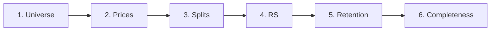

# Data Pipeline

What actually happens between "a stock traded today" and "a number appears in the database." For self-hosters diagnosing a run, and contributors changing pipeline behaviour.

[Architecture](Architecture.md) covers the system shape; this page covers the mechanics of each stage.

## The stages



`update` runs all six. `init` runs stages 1–4 with a full history download and a complete recompute.

---

## Stage 1 — Universe acquisition

**Module:** `ibd_rs/tickers.py` · **Fallback:** `ibd_rs/nasdaq_trader.py`

### Source

A Finviz screener query, via `finvizfinance`:

```python
SCREENER_FILTERS = {"Market Cap.": "+Micro (over $50mln)"}
EXCLUDED_INDUSTRIES = ["Exchange Traded Fund", "Shell Companies"]
```

This yields roughly 4,600 US-listed common stocks. The $50M floor removes nano-caps whose prices are too illiquid for momentum to mean much. ETFs are excluded because ranking a fund against its own holdings isn't a meaningful comparison; shell companies because a SPAC has no operating history to have momentum about.

`SPY` and `QQQ` are appended afterwards if the screener didn't return them, as [reference tickers](Concepts.md#reference-ticker).

The screener also carries **sector and industry** per ticker, which is written to the `tickers` table. That's the only source of the sector data behind `sector_ranking()` and friends.

### Caching

The universe is cached for 7 days (`CACHE_DAYS`) in `meta.ticker_list`. The scrape takes minutes and the universe barely moves day to day, so most daily runs skip this stage entirely. `init` forces a refresh.

### Validation

A fetch must clear three guards before it is trusted:

| Guard | Threshold | Catches |
|---|---|---|
| Absolute floor | ≥ 3,000 tickers | Catastrophic failure |
| Drop guard | ≥ 90% of last-good count | Gradual degradation |
| Completeness | raw rows ≥ 98% of screener's own reported total | Truncated pagination |

The completeness check costs one extra request to read the screener's claimed result count, then compares **pre-filter** row counts on both sides — comparing our filtered count against their unfiltered total would flag a systematic gap that isn't a truncation.

Fetches are retried up to 4 times with exponential backoff plus jitter before being declared failed.

### On failure

An untrusted fetch **never overwrites the cache**. Instead:

1. If a cached universe exists → use it, flag the run untrusted.
2. If no cache exists → fall back to the Nasdaq Trader symbol directory, flag untrusted.

The Nasdaq Trader fallback is deliberately crude: two pipe-delimited files over plain HTTPS with no anti-bot defences, so it works when a scraper is blocked. It excludes ETFs and test issues but carries no market cap, sector, or industry — a broader, lower-quality superset. It exists so a first-ever run isn't dead in the water, not as a real substitute.

Either way `trusted=False` propagates to the caller, and `update` exits 1 at the end. The run still produces data; it just refuses to call itself healthy.

### Connection handling

This stage can run for minutes with no database activity, long enough for Neon's serverless compute to auto-suspend. `fetch_ticker_list()` therefore returns `(UniverseResult, conn)` and calls `db.reconnect()` before writing. **Callers must use the returned connection** — the one they passed in may be dead.

---

## Stage 2 — Price download

**Module:** `ibd_rs/prices.py` · **Source:** yfinance

### Two modes

| | `download_initial` | `download_update` |
|---|---|---|
| Range | `period="2y"` | Trailing 10 calendar days |
| Used by | `init` | `update` |
| Duration | 20–30 min | ~2 min |

Two years for the initial load because one year of *ratings* needs one year of prices plus the 252-trading-day lookback that produces them.

### Batching and rate limits

```python
BATCH_SIZE = 75                  # was 500; smaller batches limit blast radius
DOWNLOAD_THREADS = 4             # below yfinance's default pool
DOWNLOAD_RETRY_ATTEMPTS = 5
DOWNLOAD_BACKOFF_BASE = 1.0      # 1, 2, 4, 8 seconds, plus jitter
INTER_BATCH_SLEEP_SECONDS = 2
```

Every one of these was tuned downward after rate-limit trouble. yfinance is a free unofficial endpoint with no published quota — the only workable posture is to stay well under whatever the limit is. The comments in `config.py` record the prior values, which is why the file reads as history rather than defaults.

### Failure isolation

Two failure modes, handled separately, and neither aborts the run:

**Download failure** — after 5 retries, every ticker in the batch is recorded as failed and the loop moves on.

**Storage failure** — a dropped connection mid-write marks the batch failed, rolls back so an aborted transaction doesn't poison the next batch, and continues. Before this, one dropped connection killed the entire run.

Failed tickers are recorded in `meta.failed_tickers`. They aren't retried within the run — the trailing window picks them up tomorrow.

### Missing-data detection

yfinance doesn't reliably raise when it silently omits a ticker, so detection is by coverage:

```
requested tickers − tickers with at least one non-null close = failed
```

This replaced a read of `yf.shared._ERRORS`, a private global removed in yfinance 1.x. Depending only on observable output means library refactors can't break it again.

### Why the trailing window

Re-downloading the same 10 days every run looks wasteful. It is the single most important reliability property in the pipeline — see [Architecture](Architecture.md#trailing-window-download-instead-of-a-watermark-cursor). Upserts are idempotent, so redundancy costs bandwidth and buys structural immunity to starvation.

---

## Stage 3 — Split detection and repair

**Module:** `ibd_rs/splits.py`

Prices are downloaded with `auto_adjust=True`, so yfinance normally applies split adjustments. Normally. When it doesn't — or when a split lands between runs — a 4:1 split appears as a 75% one-day crash, and the resulting ROC poisons that ticker's RS for the next year.

### Detection

Scan the last 7 days of closes for any single-day change exceeding **40%** (`SPLIT_THRESHOLD`). That threshold is a deliberate compromise: high enough that real volatility rarely trips it, low enough to catch a 2:1 split (50%).

Detection is cheap and produces false positives — a genuine 45% earnings crash gets flagged. That's fine, because flagging only triggers verification.

### Verification and repair

For each flagged ticker, query yfinance's split calendar. If a split is confirmed within the last 7 days, re-download that ticker's full 2-year history and upsert it, overwriting the unadjusted prices. If no split is confirmed, nothing happens — the flag was a false positive and the price move was real.

Repair is per-ticker and errors are caught individually, so a delisted or broken symbol can't take down the stage.

---

## Stage 4 — RS computation

**Module:** `ibd_rs/rs.py`

### Loading

All non-null closes are loaded and pivoted into a dates × tickers DataFrame. NaN cells mean "no valid close for that ticker that day" — that distinction drives everything downstream.

### RS Raw

```python
for ticker in price_df.columns:
    prices = price_df[ticker].dropna()          # ← the important line
    if len(prices) <= max_lookback:             # ← warm-up gate
        continue
    ticker_raw = sum(w * (prices / prices.shift(d) - 1)
                     for d, w in RS_WEIGHTS.items())
```

The `.dropna()` is what makes lookbacks count *that ticker's* trading days rather than calendar rows. The length gate is the [warm-up](Concepts.md#warm-up) rule: a ticker needs **more than 252** valid observations, so a stock with exactly 252 still gets nothing.

The loop is per-ticker rather than a single vectorized operation precisely because each ticker's valid-day series has a different shape.

### RS Rating

```python
pct_rank = rs_raw_df.rank(axis=1, pct=True, method="average")
rs_rating = (pct_rank * 98 + 1).round(0)

valid_counts = rs_raw_df.notna().sum(axis=1)
trusted_dates = valid_counts / universe_size >= 0.90
rs_rating.loc[~trusted_dates, :] = pd.NA
```

Ranking is `axis=1` — across tickers within each date. Ties take the average rank. NaN cells are excluded automatically, so the population is exactly the tickers with valid RS Raw that day.

The last two lines are the [universe threshold](Concepts.md#universe-threshold): any date whose coverage is below 90% has its entire row of ratings nulled. RS Raw survives — it is a per-stock number and remains valid — while the ratings, which depend on the population, do not.

### Which dates get written

`recalc_all=True` (used by `init` and `recalc`) recomputes everything.

The incremental path writes the union of two sets:

- dates newer than `last_rs_date` — normal forward progress, and catch-up after a gap
- the most recent 15 trading days — the [self-healing window](Concepts.md#self-healing-recompute-window)

The union matters. Newer-than-cursor alone would leave a threshold-failed date unrated forever once the cursor passed it.

Selected dates are cleared (`rs_raw` and `rs_rating` set to NULL) before being rewritten, so a date that *should* become unrated actually does — a plain upsert would leave the stale rating in place. Records are then written in batches of 50,000.

---

## Stage 5 — Retention

**Module:** `ibd_rs/db.py` · `prune_old_close()`

Two policies in one table, both keyed on a 13-month cutoff (`PRICE_RETENTION_MONTHS`):

```sql
DELETE FROM rs WHERE date < :cutoff AND rs_rating IS NULL;
UPDATE rs SET close = NULL WHERE date < :cutoff AND rs_rating IS NOT NULL AND close IS NOT NULL;
```

Rows that never earned a rating are removed entirely. Rows that did keep the rating and lose the price.

Closes are pruned because they're an input the calculation only looks back 252 trading days into — retaining more makes every daily pivot larger for no benefit, and pivot cost contributed to the timeouts around the original stall. Ratings are kept forever because they're the output and historical ratings are the point.

This was declared in config long before it was implemented, so data grew unbounded and every run got slower. Worth remembering when adding a constant: a declared policy that nothing executes is worse than no policy, because it reads as handled.

---

## Stage 6 — Completeness check

**Module:** `ibd_rs/db.py` · `check_latest_trading_day_completeness()`

The watchdog. It measures, for the most recent date with any price data, how many universe tickers have a close and how many have a rating, then compares close coverage against the 90% threshold.

```
Step 6/6: Latest trading day completeness...
  Latest trading day: 2026-03-19
  Universe size: 4642
  Close coverage: 4598/4642 (99.1%)
  Missing close count: 44
  RS rating coverage: 4591/4642 (98.9%)
  Missing RS rating count: 51
  Threshold: 90.0%
  Result: PASS (complete)
```

### The denominator guard

`min_universe_size=UNIVERSE_FLOOR` (3,000) is passed as an absolute floor for the denominator, independent of the universe actually fetched.

Without it the check is self-defeating: a truncated fetch of 55 tickers, all of which have prices, reads as 100% coverage and passes. Pinning the denominator to at least 3,000 means a collapsed universe fails the completeness check *because* it collapsed. Coverage counts are still measured against the real intersection — only the denominator has a floor.

### Why this exists

This stage produces no data. Its only job is to make a silent stall loud. `update` exits 1 when the check fails or the universe was untrusted, turning a green-but-stalled run into a red build that triggers the failure notification that already existed.

The original outage wasn't a missing alert channel — GitHub's failure emails worked fine. It was a failure that never announced itself. This is the announcement.

## Configuration summary

Every constant is in `ibd_rs/config.py`:

| Constant | Value | Stage |
|---|---|---|
| `SCREENER_FILTERS` | Market cap > $50M | 1 |
| `CACHE_DAYS` | 7 | 1 |
| `UNIVERSE_FLOOR` | 3000 | 1, 6 |
| `UNIVERSE_DROP_GUARD` | 0.90 | 1 |
| `UNIVERSE_COMPLETENESS_RATIO` | 0.98 | 1 |
| `UNIVERSE_FETCH_RETRIES` | 4 | 1 |
| `BATCH_SIZE` | 75 | 2 |
| `DOWNLOAD_THREADS` | 4 | 2 |
| `DOWNLOAD_RETRY_ATTEMPTS` | 5 | 2 |
| `INTER_BATCH_SLEEP_SECONDS` | 2 | 2 |
| `INITIAL_PERIOD` | `"2y"` | 2 |
| `TRAILING_WINDOW_DAYS` | 10 | 2 |
| `SPLIT_THRESHOLD` | 0.40 | 3 |
| `SPLIT_LOOKBACK_DAYS` | 7 | 3 |
| `RS_WEIGHTS` | `{63: 0.4, 126: 0.2, 189: 0.2, 252: 0.2}` | 4 |
| `RS_UNIVERSE_THRESHOLD` | 0.90 | 4 |
| `RS_RECOMPUTE_WINDOW_DAYS` | 15 | 4 |
| `PRICE_RETENTION_MONTHS` | 13 | 5 |
| `PRICE_COMPLETENESS_THRESHOLD` | 0.90 | 6 |

Changing `RS_WEIGHTS` or `RS_UNIVERSE_THRESHOLD` changes what stored ratings *mean*, which makes new values incomparable to historical ones. Treat those two as data-format changes, not tuning knobs.

## Next

- [Operations](Operations.md) — scheduling and monitoring the pipeline
- [CLI Reference](CLI-Reference.md) — the commands that drive these stages
- [Troubleshooting](Troubleshooting.md) — when a stage misbehaves

[← Back to index](README.md)
